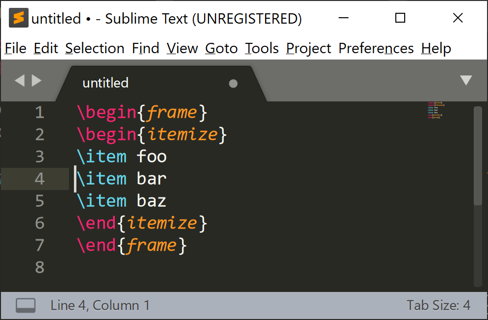
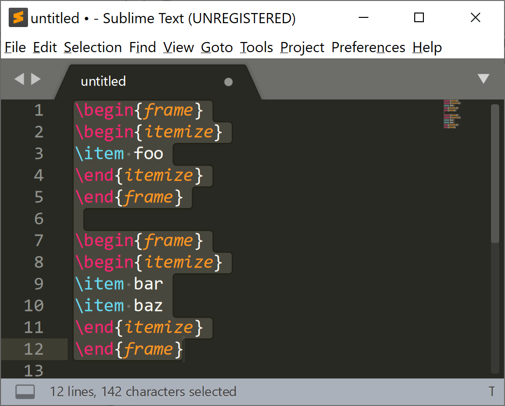
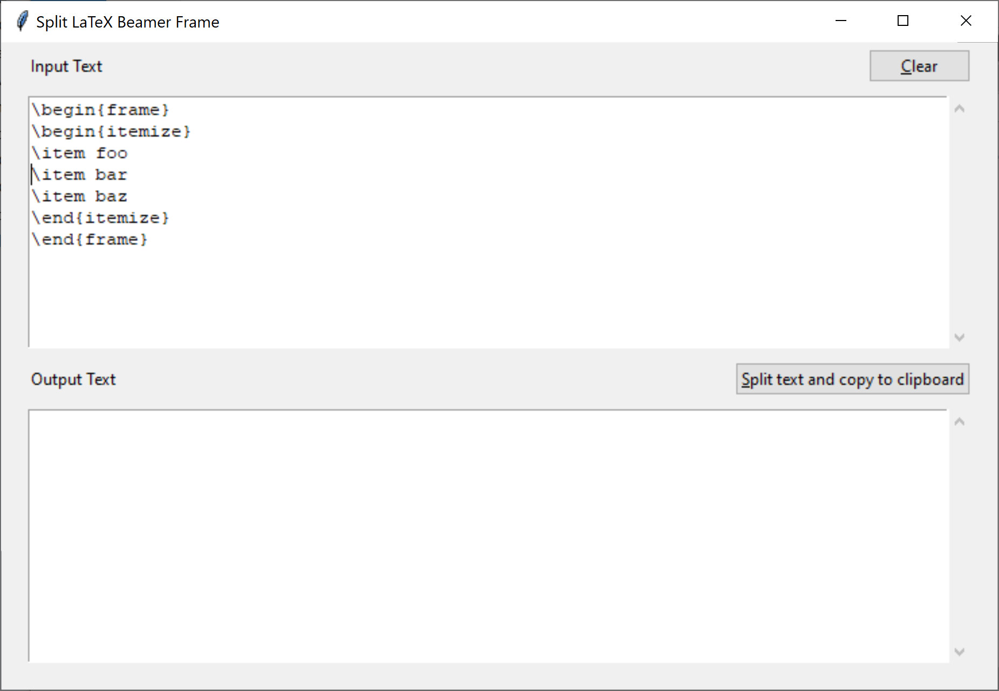
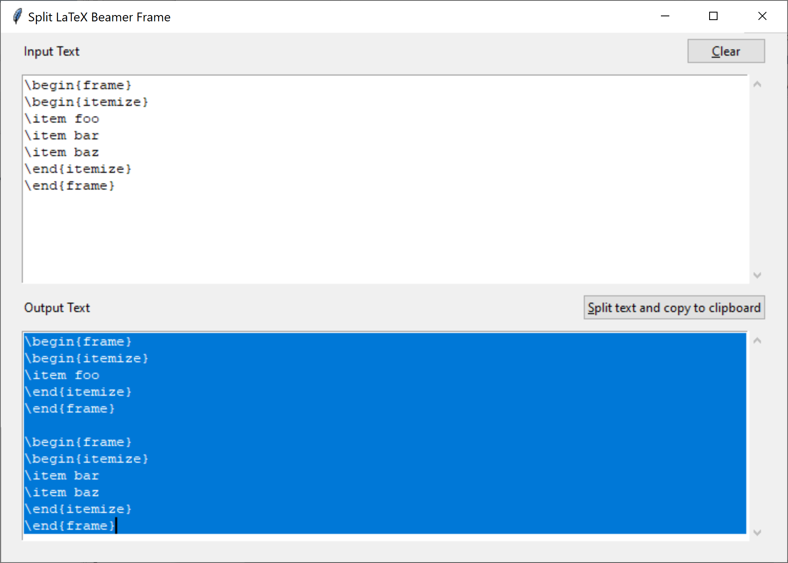

# LaTeX Split Frame

## Sublime Text 3 Plugin

Splits a `frame` in a LaTeX beamer presentation.

### Installation

Copy the files `latex_frame_split.py` and `sublime_lframe_split.py` into your Sublime User Package directory. On Windows this is usually `C:\Users\YOUR_USER_NAME\AppData\Roaming\Sublime Text 3\Packages\User`. You have to replace YOUR_USER_NAME with your actual user name.

Also download the file `Default (Windows).sublime-keymap` into your Sublime User Package directory. Replace `Windows` with the name of your operating system if you are not using Windows. If you don't want to overwrite your default keymap, copy the following into your `Default (Windows).sublime-keymap` file:
```
[
	{"keys": ["ctrl+alt+s"], "command": "lsplit"}
]
```

### Example

Input:


Press "Ctrl-Alt-s", output:



## Standalone Script with Graphical User Interface

### Installation

You should have Python 3.7+ installed. Download the .py files into a directory of your choice. 

### Usage

Open a terminal on Unix or a PowerShell on Windows, change to the directory with the .py files and type
```
python tk_lframe_split.py
```
Copy and paste LaTeX code into the input text box, place cursor at desired split position and press the "Split text and copy to clipboard" button.

### Example

Input:


Output:
